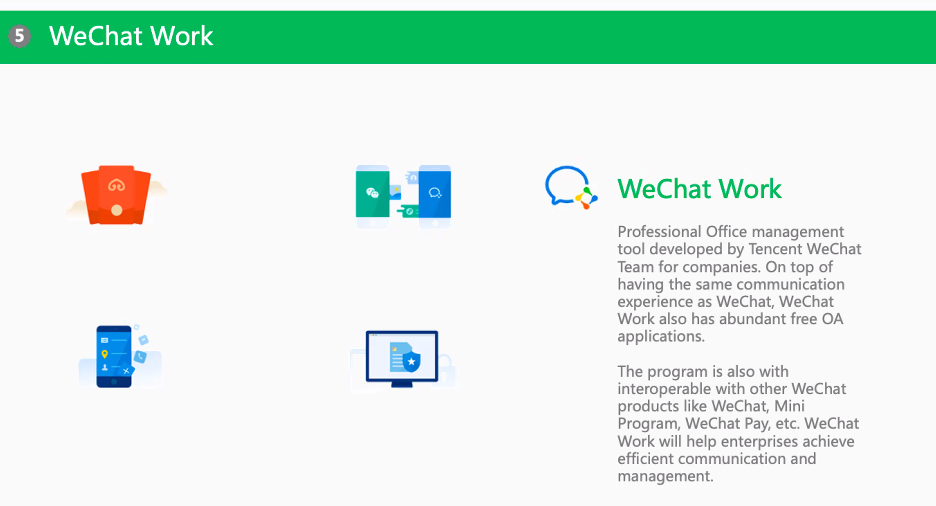

# OID897 Supply Chains in China

Prof. Gad Allon, Prof. Edwin Keh

## Introduction Course 3.16.2021

### Logistics

By **March 30th**, need:

- Project title
- Description (one or two paragraphs)
- Project plan (bullet points outlining how you will complete the project)

By **April 20th**, need a 7-minute presentation with 3 minutes for Q&A

Paper submission should happen on Canvas by **May 4th, 2021**

- 11pt font
- 1inch margins
- 1.5 line spacing
- No more than 10 pages of text
- No more than 5 pages of exhibits / tables

Groups for this project will be selected by the Professors, and can potentially
be across timezones.

### Prof. Keh's Overview on China's Supply Chains

- China has been intentionally raising the minimum wage every 5-years and at a much
faster clip than inflation so it is intentionally pricing itself out of the market
	- This is to bring the Chinese population out of poverty
	- Leads to a discussion of onshoring or shifting to cheaper cost of labor economies
- China's Problems with Contract Manufacturing
	
	- First $88 stay with footlocker, the retailer
	- Nike's wholesale price of $40 don't go to China
	- Rubber, Suede and other raw materials are imported in
	- Bottom-line that China gets to keep is $1.50
	- Cost of this $1.50 profit is the tremendous pollution and social issues so 
		China is trying to pivot away from contract manufacturing
- Vietnam is gaining interest, but the entire size of Vietnam is equivalent to 
	a single province in China
- Why Nation's Fail: there is a very strong tradeoff between coercion and innovation
	- China currently has a balance between both of them
	- Can you continue to innovate sustainably where there is a significant level of coercion
	- AI is actually one usecase where systems that centrally locate data have an 
		advantage over distributed systems
	- We are in a new data-driven regime unlike any we have seen before, which might be 
		what is giving the nation an advantage
- The further west in China you go, the more complicated the infrastructure is going to be,
	so eCommerce is a leveler because it gives everyone access to the same marketplaces
	- Every year 300M people join the middle-class who have not seen any other 
		way to shop than eCommerce
	- India is also similarly exciting because you have different groups of people with language
		barriers, tastes, etc.

### Dean Garrett's Session

- In both countries there is a lot of domestic turmoil going on, so it can be useful to pin it on the other superpower
- Bill Clinton explicitly said in support of China's admission to the WTO that the more we integrate
	China, the more they will become like us; there is now a consensus that China is no longer
	willing to play the same game US is playing and that this is new

#### US Companies

##### GM

- In 2019, GM sold more cars in China than in the USA. All these cars were made in a JV with a Chinese communist
	company
- GM did not want you to know this; they only came back to profitability based on their sales in China
- Chinese government and corporations have now decided that GM is evil because they are aligned with the US
- What should GM do about this? Production needs to be closer to the market than the home country, so producing
	in Detroit and exporting to China is not an option

##### Starbucks

Most of the global growth of Starbucks in the last 5 years has been in China

##### Tesla

- Rise in stock price of Tesla started when they announced the opening of their new plant outside of Shanghai
- Producing largely for the Chinese market, with the option for export
- Not in a JV

##### Apple

- Tim Cook is not shy about speaking to the importance of China in manufacturing
	- He mentioned it's not because of cost, but talent and quality
	- Quality of tooling engineers is best in China
- Producing in China is now more expensive than producing in Mexico
	because of tariffs, but US is still 27% more expensive
	
- China is the second largest market for Apple devices now as well; iPhones are still a status symbol

##### Takeaways

Company's just try to fly under the radar to the extent that they can

#### Chinese Companies - Huawei

- US is a taker of technology and standards related to 5G; related to step-down in government
	investment in technology post-war
- Qualcomm, Broadcom and Flex lobby Washington DC to not be as strict on Huawei because of the danger
	it poses on their supply chains
	
- Huawei is making contingency plans to become a China-only company, but their entire future
	is being appended because of politics and not underlying economics
 
#### Global China

- Largest infrastructure investor in the world
	
- Expand market access
	- Africa; raw materials
	- Europe; more markets
- Have great infrastructure and want to export it
- Want more friends on the global stage

#### Five-Eyes, Quad

**Quad**: Japan, India, Australia, USA

- Anti-China move
- India has gone from being on the sidelines on national security issues to
	siding with the USA
- Will see a lot of alliance of democracy talk this and in the coming years against China

**Five-Eyes**: UK, Australia, New Zealand, USA, Canada; Intelligence-sharing agreement
which is important for Australia to be a member of because of their unique satellite
coverage of the southern-hemisphere

## Supply Chain Overview and JD Case Discussion 3.23.2021

### Supply Chain Overview

#### Overview 

1. Network that connects everything from procurement all the way to the customer (PoS)
1. **What flows in the supply chain:**	
	1. Product: flows from producer to consumer; also have reverse logistics going the other way
	1. Money: Timing of cashflows is a problem because a supplier is putting money into raw materials now but customer only pays after the entire product is manufactured and gets sold
		1. Cash Conversion Cycle (CCC): Apple and Amazon have -30days CCC
		1. Solution: Cash refactoring; e.g. Greensill Capital
	1. Information: flows both ways; Amazon for e.g. is very reluctant to give customer data, although they do want to share aggregate information
1. **Goal of supply chains:**
	1. Match supply and demand
	1. Maximize supply chain surplus; need to think supply chain as end-to-end entity and maximize the size of the pie
		1. Individual firms should care about this because of [double marginalization](https://www.careeranna.com/articles/double-marginalization/#:~:text=Double%20Marginalization%20is%20the%20phenomenon,their%20own%20markups%20in%20prices.)
		1. Wholesaler chooses wholesale price and retail price sets market price; both entities maximize individual profit by adding a margin
		1. Optimal solution is to mazimie the collective profit; buyback contracts and other agreements try to improve visibiltiy and coordinate actions
		  

#### Assess Alignment and Fit in Supply Chain

1. To what extent is the customer imposing additional uncertainity to your supply chain
	1. Quantity of product needed
	1. Response time customers will tolerate
	1. Variety of products needed
	1. Service Level required
	1. Price of product
	1. Desired rate of innovation of the product
	  
1. How responsive is the supply chain to:
	1. Responding to wide range of quantities
	1. Meeting short lead times
	1. Handling large varieties of products
	1. Meeting high service level
1. Strategic Fit
	  
	1. Below the zone of strategic fit: long tail of customer demand
		1. 80-20 Pareto rule assumes 80% of profit comes from top-20 SKUs, and this assumption is broken by e-commerce companies like Amazon, JD, etc.
		1. Firms on the efficient end of the supply chain make money by pooling demand
	1. Above the zone of strategic fit: bespoke manufacturers; not at all predictable demand
	1. **StitchFix vs GAP**
		1. Stitchfix has very certain and efficient supply chain
		1. GAP has very uncertain demand; traditional retail is very unpredicatable and they have to build a supply chain to deal with that

### Alibaba Group Speakers

- Eric Pelletier, Head of International Relations, Alibaba Group
- Bill Anaya, VP of International Affairs, Alibaba Group

FreshHippo offers 30-min delivery to within a 3-km radius of the store; can be as large as an entire mall basement

- Cainiao is a coordination platform for 3PL providers
- Most products are 3P-merchants owned; JD is more of a 1P model
- Cainiao is like UPS / Fedex; a merchant / customer can select who they want their goods delivered by, and the network makes it happen

### Tencent Speaker

- Neo Liu, Head of NA Publishing, Tencent
- Shirley Xue, Shirley Xue, GM at Tencent, M&A execution and Portfolio Management
	- Currently at Soul App Tencent investment
	- Soul App is a Chinese social networking and dating platform

#### History of Tencent

**Agenda for expanding internationally**

- Cloud: privacy issues are prelavant, and this is a major blocker
- Payments: privacy issues, same as cloud
- Gaming: no limitations for international expansion; seeing massive growth in this vertical

**Specific regions as targets for international expansion**

- If a lot of Chinese tourists go somewhere, we try to make it available there. E.g. Japan, Bay Area, etc.
- Biggest blocker for internation expansion is that some other messaging applications have already gained traction

#### Mini Program

Mini-program vs website:

Setting up your own WeChat ecosystem using mini-programs

#### Mini Games

#### Business Communication: WeChat Work

#### WeChat Pay

- Catching up with AliPay in the payments game when WeChat Pay started
- Started with WeChat Red Envelope: like a social game
- Different from AliPay, which is pure payments, because this has social aspect of money transfer

**PoS Methods using WeChat Pay**: 

- Cut is lower than what credit cards take
- Not bypassing credit / debit cards; still go through the bank
- Both AliPay and WeChat Pay are working on facial recognition for payment authentication

**Comparison with Ant Financial**

- Tencent does not want to get into financial lending because it is too risky and attracts government attraction
- WeChat does offer lending, but in a much more conservative way

#### WeChat Games

- Contribute to 50% of WeChat revenue
- 33% of total Tencent revenue comes from games

#### WeChat Advertising

- **Neo's anecodtal evidence:** on Facebook, you see a lot of personalized advertising but its not too accurate
- Tencent has more brand ads, instead of geared towards conversion
- Tencent allows you to have more experiences behind ads than other platforms with linked miniprograms, etc.

#### Market Competition

- Whenever a new social media app comes out, like ClubHouse, everyone thinks they are potential competitors
- Have seen several market cycles of new social media, and we've survived through everything
- Dominate in social networks, but need to keep improving our experience

#### Tencent Appendix

### [JD Case Notes](https://github.com/sheilsarda/ResearchNotes/blob/master/china_supply_chains/Cases/JD%20Envisioning%20the%20Future%20of%20Retail%20(A).pdf)

#### Overview of JD and Chinese Retail Landscape

1. Second largest e-commerce company in China by Gross Merchandise Volume (GMV)
1. Offer same-or-next-day delivery as a standard service for Chinese customers
1. In 2016, China surpassed the United States as the world’s largest retail market; its total 2016 sales was $4.886 trillion compared to $4.823 trillion in the U.S
1. Offline retail stores make up approximately 85% of China’s total retail market; in the US, this is 78.7% of total retail sales in 2020
1. JD coined the term “boundaryless retail” to describe retail in the digital age. According to JD, retailing had become boundaryless in the following ways	
	1. There were no physical boundaries to where and when consumers shopped. They could shop online, offline, on their computers, or on their mobile phones
	1. Second, products had transcended their traditional uses. They might come with services and/or content and collect data simultaneously
	1. Third, retailers must move beyond traditional ways of selling
	online or in stores and engage with consumers to provide a personalized shopping experience

#### JD History

Despite its late arrival, JD distinguished itself among competitors with a staunch commitment to customer service and a zero tolerance policy toward counterfeits. To Liu, the essence of retail was about operating cost, efficiency, and customer experience

On some other e-commerce platforms, those sellers that sell counterfeits could charge the same prices as sellers selling authentic products, and as a result, they have money to advertise on these platforms, and sometimes drive their competitors out of the market or convert them into counterfeit sellers. The platforms can profit from these ads and may not have incentives to intervene

Shortly before its 2014 IPO, JD entered into a five-year strategic cooperation agreement and an eight-year non-compete agreement with Tencent, owner of the popular WeChat and Mobile QQ apps. The partnership gave JD access to the world’s largest mobile user base—WeChat’s over 1 billion active users

JD’s partnership with Yonghui in 2015, China’s top supermarket that operated more than 500 local neighborhood stores, gave the company the capacity to offer fresh foods

In 2016, JD formed a strategic partnership with Walmart. Walmart had entered China’s e-commerce market in 2011 by investing in Yihaodian, an e-commerce firm. But the venture was unsuccessful because it could not compete with Alibaba’s and JD’s dominance in e-commerce

Thus in June 2016, Walmart sold its e-commerce operations to JD for an initial 5.0% stake. The stake increased to 10.1% by February 2017.  Under this partnership, JD would carry over 1,700 of the most popular items in Walmart’s physical stores in China and fulfill the orders with Dada’s logistics

This partnership would expand JD’s offerings in imported products, and consumers could buy them directly from the Walmart store on JD. In return, with access to JD’s customers, delivery network, and big data, Walmart would boost its sales and improve its customer service

#### JD Supply Chain

Liu developed an inverted triangle model to show how JD delivered top customer service with great efficiency

Its distribution centers had three tiers: 
	- regional distribution centers
	- forward distribution centers
	- town distribution centers

We call this process **short chain**

- Short chain reduces the number of movements [of goods] and cuts down on transportation distance
- Typically, in order to get merchandise from a warehouse to customer, the merchandise might be transported four to five times or more
- JD wants to reduce the entire number of movements to one or two times

Because JD sourced many products by itself, the team relied on demand forecasting to determine how many of certain products to source at certain times of the year

#### Future of Chinese Commerce 

Alibaba New Retail:

1. A key feature of Hema was its ability to deliver orders within 3 kilometers within 30 minutes
1. As of 2015, Alibaba had opened 13 Hema markets—ten in Shanghai, two in Beijing, and one in Ningbo—and each store served customers within a three-kilometer radius so Hema could provide fast and high-quality service
1. Furthermore, Hema also had its own logistics system, with an in-store warehouse that allowed order-fulfillment specialists to scan, pack up the goods and send them to the delivery center nearby quickly
1. With such efficient distribution network, each Hema store was able to fulfill thousands of orders a day
1. Hema’s customers made about 4.5 purchases per month and 50 times a year
	1. Once a user opened the app, their likelihood of making a purchase was 35%
	1. Online orders made up more than 50% of total orders
1. “Hema is a showcase of the new business opportunities that emerges from online-offline integration,” Daniel Zhang, Alibaba Group CEO, remarked