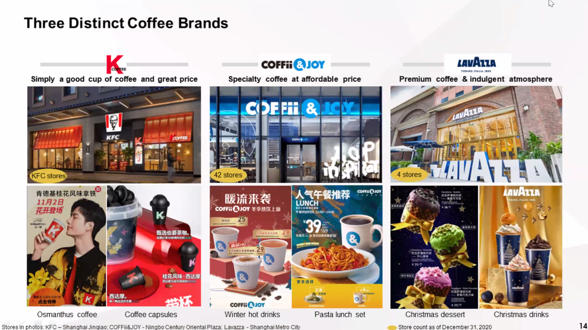
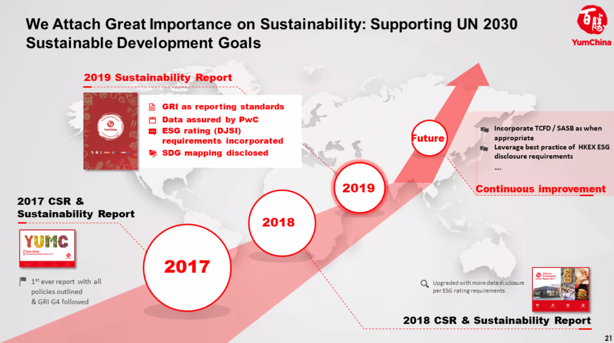

# OID897 Supply Chains in China

Prof. Gad Allon, Prof. Edwin Keh, Prof. Santiago Gallino

## Introduction Course 3.16.2021

### Logistics

By **March 30th**, need:

- Project title
- Description (one or two paragraphs)
- Project plan (bullet points outlining how you will complete the project)

By **April 20th**, need a 7-minute presentation with 3 minutes for Q&A

Paper submission should happen on Canvas by **May 4th, 2021**

- 11pt font
- 1inch margins
- 1.5 line spacing
- No more than 10 pages of text
- No more than 5 pages of exhibits / tables

Groups for this project will be selected by the Professors, and can potentially
be across time zones.

### Prof. Keh's Overview on China's Supply Chains

- China has been intentionally raising the minimum wage every 5-years and at a much
faster clip than inflation so it is intentionally pricing itself out of the market
  - This is to bring the Chinese population out of poverty
  - Leads to a discussion of onshoring or shifting to cheaper cost of labor economies
- China's Problems with Contract Manufacturing
    
    

  - First $88 stay with footlocker, the retailer
  - Nike's wholesale price of $40 don't go to China
  - Rubber, Suede and other raw materials are imported in
  - Bottom-line that China gets to keep is $1.50
  - Cost of this $1.50 profit is the tremendous pollution and social issues so
        China is trying to pivot away from contract manufacturing
- Vietnam is gaining interest, but the entire size of Vietnam is equivalent to
    a single province in China
- Why Nation's Fail: there is a very strong tradeoff between coercion and innovation
  - China currently has a balance between both of them
  - Can you continue to innovate sustainably where there is a significant level of coercion
  - AI is actually one use case where systems that centrally locate data have an
        advantage over distributed systems
  - We are in a new data-driven regime unlike any we have seen before, which might be
        what is giving the nation an advantage
- The further west in China you go, the more complicated the infrastructure is going to be,
    so eCommerce is a leveler because it gives everyone access to the same marketplaces
  - Every year 300M people join the middle-class who have not seen any other
        way to shop than eCommerce
  - India is also similarly exciting because you have different groups of people with language
        barriers, tastes, etc.

### Dean Garrett's Session

- In both countries there is a lot of domestic turmoil going on, so it can be useful to pin it on the other superpower
- Bill Clinton explicitly said in support of China's admission to the WTO that the more we integrate
    China, the more they will become like us; there is now a consensus that China is no longer
    willing to play the same game US is playing and that this is new

#### US Companies

##### GM

- In 2019, GM sold more cars in China than in the USA. All these cars were made in a JV with a Chinese communist
    company
- GM did not want you to know this; they only came back to profitability based on their sales in China
- Chinese government and corporations have now decided that GM is evil because they are aligned with the US
- What should GM do about this? Production needs to be closer to the market than the home country, so producing
    in Detroit and exporting to China is not an option

##### Starbucks

Most of the global growth of Starbucks in the last 5 years has been in China

##### Tesla

- Rise in stock price of Tesla started when they announced the opening of their new plant outside of Shanghai
- Producing largely for the Chinese market, with the option for export
- Not in a JV

##### Apple

- Tim Cook is not shy about speaking to the importance of China in manufacturing
  - He mentioned it's not because of cost, but talent and quality
  - Quality of tooling engineers is best in China
- Producing in China is now more expensive than producing in Mexico
    because of tariffs, but US is still 27% more expensive
      
- China is the second largest market for Apple devices now as well; iPhones are still a status symbol

##### Takeaways

Company's just try to fly under the radar to the extent that they can

#### Chinese Companies - Huawei

  

- US is a taker of technology and standards related to 5G; related to step-down in government
    investment in technology post-war
- Qualcomm, Broadcom and Flex lobby Washington DC to not be as strict on Huawei because of the danger
    it poses on their supply chains
      
- Huawei is making contingency plans to become a China-only company, but their entire future
    is being appended because of politics and not underlying economics

#### Global China

- Largest infrastructure investor in the world
      
- Expand market access
  - Africa; raw materials
  - Europe; more markets
- Have great infrastructure and want to export it
- Want more friends on the global stage

#### Five-Eyes, Quad

**Quad**: Japan, India, Australia, USA

- Anti-China move
- India has gone from being on the sidelines on national security issues to
    siding with the USA
- Will see a lot of alliance of democracy talk this and in the coming years against China

**Five-Eyes**: UK, Australia, New Zealand, USA, Canada; Intelligence-sharing agreement
which is important for Australia to be a member of because of their unique satellite
coverage of the southern-hemisphere

## Supply Chain Overview and JD Case Discussion 3.23.2021

### Supply Chain Overview

#### Overview

1. Network that connects everything from procurement all the way to the customer (PoS)
1. **What flows in the supply chain:** 
    1. Product: flows from producer to consumer; also have reverse logistics going the other way
    1. Money: Timing of cashflows is a problem because a supplier is putting money into raw materials now but customer only pays after the entire product is manufactured and gets sold
        1. Cash Conversion Cycle (CCC): Apple and Amazon have -30days CCC
        1. Solution: Cash refactoring; e.g. Greensill Capital
    1. Information: flows both ways; Amazon for e.g. is very reluctant to give customer data, although they do want to share aggregate information
1. **Goal of supply chains:**
    1. Match supply and demand
    1. Maximize supply chain surplus; need to think supply chain as end-to-end entity and maximize the size of the pie
        1. Individual firms should care about this because of [double marginalization](https://www.careeranna.com/articles/double-marginalization/#:~:text=Double%20Marginalization%20is%20the%20phenomenon,their%20own%20markups%20in%20prices.)
        1. Wholesaler chooses wholesale price and retail price sets market price; both entities maximize individual profit by adding a margin
        1. Optimal solution is to mazimie the collective profit; buyback contracts and other agreements try to improve visibiltiy and coordinate actions
          

#### Assess Alignment and Fit in Supply Chain

1. To what extent is the customer imposing additional uncertainity to your supply chain
    1. Quantity of product needed
    1. Response time customers will tolerate
    1. Variety of products needed
    1. Service Level required
    1. Price of product
    1. Desired rate of innovation of the product
      
1. How responsive is the supply chain to:
    1. Responding to wide range of quantities
    1. Meeting short lead times
    1. Handling large varieties of products
    1. Meeting high service level
1. Strategic Fit
      
    1. Below the zone of strategic fit: long tail of customer demand
        1. 80-20 Pareto rule assumes 80% of profit comes from top-20 SKUs, and this assumption is broken by e-commerce companies like Amazon, JD, etc.
        1. Firms on the efficient end of the supply chain make money by pooling demand
    1. Above the zone of strategic fit: bespoke manufacturers; not at all predictable demand
    1. **StitchFix vs GAP**
        1. Stitchfix has very certain and efficient supply chain
        1. GAP has very uncertain demand; traditional retail is very unpredictable and they have to build a supply chain to deal with that

### Alibaba Group Speakers

- Eric Pelletier, Head of International Relations, Alibaba Group
- Bill Anaya, VP of International Affairs, Alibaba Group

FreshHippo offers 30-min delivery to within a 3-km radius of the store; can be as large as an entire mall basement

- Cainiao is a coordination platform for 3PL providers
- Most products are 3P-merchants owned; JD is more of a 1P model
- Cainiao is like UPS / FedEx; a merchant / customer can select who they want their goods delivered by, and the network makes it happen

### Tencent Speaker

- Neo Liu, Head of NA Publishing, Tencent
- Shirley Xue, GM at Tencent, M&A execution and Portfolio Management
  - Currently at Soul App Tencent investment
  - Soul App is a Chinese social networking and dating platform

#### History of Tencent

##### Agenda for expanding internationally

- Cloud: privacy issues are prevalent, and this is a major blocker
- Payments: privacy issues, same as cloud
- Gaming: no limitations for international expansion; seeing massive growth in this vertical

##### Specific regions as targets for international expansion

- If a lot of Chinese tourists go somewhere, we try to make it available there. E.g. Japan, Bay Area, etc.
- Biggest blocker for international expansion is that some other messaging applications have already gained traction

#### Mini Program

Mini-program vs website:

Setting up your own WeChat ecosystem using mini-programs

#### Mini Games

#### Business Communication: WeChat Work

#### WeChat Pay

- Catching up with AliPay in the payments game when WeChat Pay started
- Started with WeChat Red Envelope: like a social game
- Different from AliPay, which is pure payments, because this has social aspect of money transfer

##### PoS Methods using WeChat Pay

- Cut is lower than what credit cards take
- Not bypassing credit / debit cards; still go through the bank
- Both AliPay and WeChat Pay are working on facial recognition for payment authentication

##### Comparison with Ant Financial

- Tencent does not want to get into financial lending because it is too risky and attracts government attraction
- WeChat does offer lending, but in a much more conservative way

#### WeChat Games

- Contribute to 50% of WeChat revenue
- 33% of total Tencent revenue comes from games

#### WeChat Advertising

- **Neo's anecdotal evidence:** on Facebook, you see a lot of personalized advertising but its not too accurate
- Tencent has more brand ads, instead of geared towards conversion
- Tencent allows you to have more experiences behind ads than other platforms with linked miniprograms, etc.

#### Market Competition

- Whenever a new social media app comes out, like ClubHouse, everyone thinks they are potential competitors
- Have seen several market cycles of new social media, and we've survived through everything
- Dominate in social networks, but need to keep improving our experience

#### Tencent Appendix

### [JD Case Notes](https://github.com/sheilsarda/ResearchNotes/blob/master/china_supply_chains/Cases/JD%20Envisioning%20the%20Future%20of%20Retail%20(A).pdf)

#### Overview of JD and Chinese Retail Landscape

1. Second largest e-commerce company in China by Gross Merchandise Volume (GMV)
1. Offer same-or-next-day delivery as a standard service for Chinese customers
1. In 2016, China surpassed the United States as the world’s largest retail market; its total 2016 sales was $4.886 trillion compared to $4.823 trillion in the U.S
1. Offline retail stores make up approximately 85% of China’s total retail market; in the US, this is 78.7% of total retail sales in 2020
1. JD coined the term “boundary less retail” to describe retail in the digital age. According to JD, retailing had become boundary less in the following ways:
    1. There were no physical boundaries to where and when consumers shopped. They could shop online, offline, on their computers, or on their mobile phones
    1. Second, products had transcended their traditional uses. They might come with services and/or content and collect data simultaneously
    1. Third, retailers must move beyond traditional ways of selling
    online or in stores and engage with consumers to provide a personalized shopping experience

#### JD History

Despite its late arrival, JD distinguished itself among competitors with a staunch commitment to customer service and a zero tolerance policy toward counterfeits. To Liu, the essence of retail was about operating cost, efficiency, and customer experience

On some other e-commerce platforms, those sellers that sell counterfeits could charge the same prices as sellers selling authentic products, and as a result, they have money to advertise on these platforms, and sometimes drive their competitors out of the market or convert them into counterfeit sellers. The platforms can profit from these ads and may not have incentives to intervene

Shortly before its 2014 IPO, JD entered into a five-year strategic cooperation agreement and an eight-year non-compete agreement with Tencent, owner of the popular WeChat and Mobile QQ apps. The partnership gave JD access to the world’s largest mobile user base—WeChat’s over 1 billion active users

JD’s partnership with Yonghui in 2015, China’s top supermarket that operated more than 500 local neighborhood stores, gave the company the capacity to offer fresh foods

In 2016, JD formed a strategic partnership with Walmart. Walmart had entered China’s e-commerce market in 2011 by investing in Yihaodian, an e-commerce firm. But the venture was unsuccessful because it could not compete with Alibaba’s and JD’s dominance in e-commerce

Thus in June 2016, Walmart sold its e-commerce operations to JD for an initial 5.0% stake. The stake increased to 10.1% by February 2017.  Under this partnership, JD would carry over 1,700 of the most popular items in Walmart’s physical stores in China and fulfill the orders with Dada’s logistics

This partnership would expand JD’s offerings in imported products, and consumers could buy them directly from the Walmart store on JD. In return, with access to JD’s customers, delivery network, and big data, Walmart would boost its sales and improve its customer service

#### JD Supply Chain

Liu developed an inverted triangle model to show how JD delivered top customer service with great efficiency

Its distribution centers had three tiers:
    - regional distribution centers
    - forward distribution centers
    - town distribution centers

We call this process **short chain**

- Short chain reduces the number of movements [of goods] and cuts down on transportation distance
- Typically, in order to get merchandise from a warehouse to customer, the merchandise might be transported four to five times or more
- JD wants to reduce the entire number of movements to one or two times

Because JD sourced many products by itself, the team relied on demand forecasting to determine how many of certain products to source at certain times of the year

#### Future of Chinese Commerce

Alibaba New Retail:

1. A key feature of Hema was its ability to deliver orders within 3 kilometers within 30 minutes
1. As of 2015, Alibaba had opened 13 Hema markets—ten in Shanghai, two in Beijing, and one in Ningbo—and each store served customers within a three-kilometer radius so Hema could provide fast and high-quality service
1. Furthermore, Hema also had its own logistics system, with an in-store warehouse that allowed order-fulfillment specialists to scan, pack up the goods and send them to the delivery center nearby quickly
1. With such efficient distribution network, each Hema store was able to fulfill thousands of orders a day
1. Hema’s customers made about 4.5 purchases per month and 50 times a year
    1. Once a user opened the app, their likelihood of making a purchase was 35%
    1. Online orders made up more than 50% of total orders
1. “Hema is a showcase of the new business opportunities that emerges from online-offline integration,” Daniel Zhang, Alibaba Group CEO, remarked

## US China Trade Relationships 4.6.2021

### Jon Huntsman Jr. - Former US Ambassador to China

1. Private sector is more likely to bring change in China based on best-practices in business
1. To what extent did the previous administration shape what's going to happen in the future
    1. China has arrived on the global scene and their confidence is very high
    1. Test them the first little while to see how they are going to respond
        1. Expect something in the South and East China Sea
        1. Expect more bluster on the negotiation tables
        1. They are now willing to take on the US in the public eye and calling people out
1. The question in boardrooms right now is to what extent do we need to go full-throttle in China vs hedging our bets by managing supply chains in various countries
   1. At what point does this get politicized
   1. Backlash could be people boycotting products, strikes in front of your manufacturing plants
   1. Biden is going to find areas where there is collaboration with China, and will work with US allies
1. Many of our allies are waiting for a grand strategy that can be sustained
   1. We are put on the defensive when dealing with countries who have a longer-term trade strategy
   1. Amy Schumer is going to come forward with a Christmas tree style agenda with a lot of amendments and a plan to get Capitol Hill unified
1. Taiwan: what does our security guarantee for Taiwan mean; is there a de-escalation strategy?
   1. Economic strategy with Taiwan has always been robust, especially in the semiconductor sector
   1. Nvidia and Intel are going long in the US, which will reduce some importance of Taiwan as a trading partner

### Rick Helfenbien - Retail & Fashion Industry Consultant

- [About Speaker](https://www.rickhelfenbein.com/about-rick.html)
- Former Chairman, President & CEO American Apparel & Footwear Association
- He also served as President of all USA operations for Luen Thai Holdings Limited (Hong Kong) and was in charge of the USA Companies in New York, New Jersey, Ohio, and California
- Mr. Helfenbein has worked extensively in USA domestic manufacturing as well as the Caribbean, China, and in most points of Asia.
He was a President at Lacoste and a Managing Director at Burlington Industries

#### About Retail's performance since COVID

1. Clothing and accessories is down 15% but the retail category as a whole is up 15%
1. Retail supports 1 out of every 4 jobs in the US, so when retail takes a hit, everything does
1. Largest string of bankruptcies in 10 years; lost 11,000 fashion stores
1. Had way too much space (sq. feet per person) and COVID only accelerated this vacating of space

#### US China Trade War and Retail

1. Trump tried to manually balance trade with China, whereas this should expand and contract based on looseness of the economic climate
1. Economist Peter Navarro escalated this issue further by trumping up charges on China
1. Apparel and Footwear were not included in tranche 1 and 2, but they started nipping at this category from tranche 3
1. Prior to US China tariffs, this category already had tariffs with 20% duty from Smoot-Hawley; China is our number one supplier, and 40% of our apparel market
1. Biden administration is holding off on doing anything about tariffs for now
1. Top three frictions when thinking about transitioning away from China manufacturing
   1. As a commodity maker (sweatshirts, underwear, etc.) where long runs of simple products, Central America is great because we're great at growing and spinning cotton
   1. We're not great at assembling, so you can send to Mexico, Haiti, etc.
   1. This does not work well for the [*iTY* generation](https://www.forbes.com/sites/rickhelfenbein/2020/10/30/americas-sustainable-election-retail-moves-from-ation-nation-to-the-ity-economy/?sh=2279d2585b50) who want quick turns; to meet all the requirements, companies need to have a supply chain in China as well
      - equality
      - diversity
      - circularity
      - traceability
      - sustainability
1. Barriers currently making it hard to do business with China
   1. Costlier to buy from China right now because RMB appreciated
   1. Bankruptcies in retail industry emerged months later, but these managers are now demanding hard terms, demanding 90 days of receipts; this might not work for Chinese manufacturers
   1. Credit markets are dry to the bone, so borrowing for PO financing is a problem
   1. Xinxiang is a major issue right now, both for getting materials out of China from this region, or to send products to sell in USA (because of boycotting)
1. Advice for the boardroom
   1. Stay out of politics, because there is no way to win in the court room
   1. Rick advised the AAFA industry association to be a purveyor of information, but don't take a position; after he left, they took a position of being against forced labor

#### How to make clothing more sustainable

1. Desire to do it exists, but materials are not as comfortable to wear
1. Besides Patagonia, a few brands have also been able to be the good guys all the time like VF Corporation
1. Problems happen where the rubber meets the road on sustainability; how do you handle when economies are not doing well

### Wilkie Wong - Managing Director, Production Planning & Logistics at Esquel Group

- BSc Civil Engineering, Columbia, MSc Operations Research, Columbia, MBA, MIT Sloan.
- Esquel is a major apparel manufacturer making apparel for many major brands

#### Global Garment Sales by Region

1. Europe used to be 10-15 and is now 25%
1. China grew from <5% to 22%
1. US shrunk from 50% to 30%
1. Expecting US sales in 2040 to shrink to 20% and China sales to fill in the gap

1. Abolishment of Quotas made a significant change in the way supply chains were structured because there were no longer regulations preventing market entry
1. This led to consolidation because now retailers could concentrate their buying dollars with just a few manufacturers
1. Supply chains were set up in an awkward way with goods routed through countries which have larger quotas like Hong Kong and manufactured in different countries like China
1. When additional tariffs were implemented in 2016, companies shifted production of textiles to avoid import duty from China to Vietnam or share additional duties with customers

## Selling in China 4.13.2021

### Aamir Sakhia - Chief Operating Officer, Lane Crawford

#### About Lane Crawford

- Lane Crawford is a Department Store selling luxury goods in Hong Kong and Mainland China
- Founded in Hong Kong in 1850, Lane Crawford has more than 54,348 square meters of total retail space, including several physical locations throughout China, as well as an online store
- Lane Crawford is a part of The Lane Crawford Joyce Group, a fashion retail and brand management group in Asia which also includes Joyce Boutique, Pedder Group and ImagineX

#### How have customers in China evolved

- Shift from cash to digital
- Brand preferences have moved beyond even the most well-known global brands, and more towards individual designers
- Shift in interest from products towards experiences, turbo-charged during the pandemic
- Move from consumption offshore to onshore
	- Historically, the majority of luxury purchases used to occur outside of the mainland 
	- Legitimate distribution is now readily available with the same product availability
	- Prices have also harmonized more, and domestic duty free has helped in this regard
- Dynamism of online shopping in China is interesting, but our value is primarily in how we provide the next level of personalized service

#### Supply Chains

- Two separate supply chains for HK vs mainland China
- China has made huge inroads in automation and simplifying clearance procedures
- Everyone needs to work through a 3PL because there are still some complications
- Comparing efficiencies between the two:
	- Don't pick-up anything outside of China until we have figured out that it can get cleared
	- Labeling requirements for China are unique and need to be specified in a certain way and affixed on the garment
	- Because of the differences in the style and brand assortment for mainland China vs HK, it doesn't make sense to harmonize these supply chains
- In HK, we own 100% of the supply chain (owning SKUs, logistics, etc.), so 1PL 
- 1P owned SKUs and use 3PL to fulfill store demand in China
	- 3PL runs warehouse and online fulfillment using the Beijing, Chengdu and Shanghai stores as fulfillment centers
	- Have been working with the same 3PL for over 20 years, and we are very involved in the day-to-day ops
	- Have KPIs that we measure around cost, lead-time, etc. with SLAs
	- Ability to use stores as pack centers in China improves speed of delivery, but we're not going to be the fastest because we include all our store inventory online which requires synchronization

#### Complexities that still exist

- All apparel needs to go through an inspection process via CIQ where garments' composition are checked against authentic goods
- Beauty brands that were resistant to animal testing have not been available on the mainland for a long time, although some exceptions have been made recently
- Our supply chain starts when our brands finish production, so our sustainability initiatives are focused on de-carbonizing our transportation

#### Variances between Chinese markets

- Brand portfolios
	- Chengdu is much more mix and match, have a high and low market
	- Shanghai knowledge-base and awareness about fashion is much more broad-based
- Chengdu customers are more willing to experiment with more colors and trends
- Beijing customers are pretty definitive on what they want, so teams need to be less flexible in the products they introduce

#### Growth Strategy

- We're not going to be the best at same-day delivery compared to the pure-play online sites
- It's not that online is not important, but if we don't know you as a customer outside of online you won't get the full experience
- The most valuable customers for us are primarily offline + online (digital engagement)
- Our sales teams have the tools necessary to make the omni-channel experience frictionless

### Danny Tan - Chief Supply Chain Officer, Yum China

#### About Yum China

- [Yum China Holdings, Inc.](https://ir.yumchina.com/investor-overview) is China’s largest restaurant company
- Operates over 10,000 restaurants in over 1,400 cities and towns spanning every province and autonomous region across mainland China
- Yum China became an independent publicly traded company on November 1, 2016 on the NYSE, and was secondary-listed on the HKEX on September 10, 2020

#### Yum China Menu Offerings

####  Growth Strategy

- China's GDP is only 20% of the USA
- Shanghai and Beijing are highly penetrated, but there is a lot of growth opportunities everywhere
- We can grow to 20,000 stores easily
- Penetration into lower tier-cities
	- Different store sizes in smaller cities
	- Smaller cities are more price sensitive, so more tailored products for their preferences
- Coffee is still a huge untapped opportunity in China that Starbucks, Tim Hortons, etc. are trying to get a slice of the pie of
	- Manage commodity price cycle and provide the same high quality cup regardless of these prices
	- Invested in Lavazza to try to make a dent in this market
- Position ourselves as a food platform for high quality food experiences, both local and western
- New store openings are now a science rather than an art, with robust processes which use inputs like demographics, comparable stores, etc. 

#### Yum Supply Chain

Food delivery at scale

- Run our supply chain in-house, including logistics centers, warehouses, etc.
- Track product temperature in route for all frozen and chilled products to detect spoilage

Food Innovation

- Involved in food innovation from the get-go
- Ensures food quality and delivery SLAs are always met

#### Factors shaping success in dine-in format

- Pizza hut used to be a window to the Western world
- Evolved into a cross between Cheesecake Factory and Applebee's to keep up with the interest of the global Chinese customer
- Pioneer of digital technologies for ordering and interacting with our physical presence
- Still learning about Taco Bell's presence and how it can resonate with the Chinese customer, but we hope to grow it to be as large as KFC or Pizza Hut one day

#### Sustainability Efforts

### Ming Mei - CEO, Co-Founder GLP 

#### About GLP 

- GLP was founded in 2009 as a logistics real estate investor, developer and operator for the logistics industry
- Leading global investment manager and business builder in logistics, real estate, infrastructure, finance and related technologies
- Have one of the largest industrial real estate portfolio in China, Brazil, Japan, and the US
- In 2020, GLP took a major share of Li & Fung (one of the largest consumer sourcing companies in the world)

#### Warehouses

- What differentiates the cost of a warehouse facility these days is location (land costs)
- International standards of floor height are 10.5 meters
- Ways things were sold and distributed shaped the infrastructure
	- Moving towards same-day delivery, regional distribution centers do not work
	- Need to have city and even neighborhood distributions
- Logistics is now becoming a service that can differentiate your product offering
	- The end-user now has more visibility on the logistics
	- Can now start pricing logistics as an added service and invest more in making it better
	- To make 30-minute delivery happen, you need to have robust forecasting and warehousing up until the last mile
- Cost of sensors are now so low that you can measure usage of an asset at the smallest unit, so you can now turn this asset into a service so that people can be charged for their usage
- Warehouses in China are very similar to US and Europe, but the warehouses in Japan have different configurations
	- Japan assets go vertical because of the scarcity of land
	- Warehouses in Japan are 2/3rd of the net clear height compared to US and Europe
	- Warehouses in Shanghai, Beijing are moving towards this vertical model as well
	- Previously warehouses were built for forklift capabilities, but now automation technology has eliminated these constraints

#### New Business Models Disrupting Big-Box Retail

- There exists companies in Guangzhou that use social media to detect demand for a new design
- From the time they gather enough demand, it is a 1-week turnaround time to manufacture and ship to USA at a $4-5 price point
- Compared to a Walmart, a garment that you see in stores there took 9 months from concept to reaching the shop floor
- 7 Boeing 747 worth of products leaving the Guangzhou airport every day, and this one company is purchasing 30% of all available air cargo space
- The supply chain configurations needed to make this happen are small-batches, have raw materials and machines all on-site, etc.
- Big box stores currently lease warehouses from players like GLP
- A lot of times, the products are not getting made until the consumer actually buys the product (C2M : Consumer to Manufacturer)
	- Consumers think they have a choice, but nothing random is cheap or efficient
	- All the data manufacturers collect about consumers make the manufacturers very smart on what each customer is going to buy at the end of the day even before they make a choice
	- Data-driven planned economy 

#### Evaluating People

- If someone walks around thinking that everything they have is because they are smart, they don't have the right humility that we're looking for
- Want people who are hardworking and smart, but not full of themselves
- If you hire a racing horse, don't need to smack it to make it run fast, but if you hire a different animal (e.g. pig), no amount of smacking will make it fast
- No asshole policy that we take very seriously

#### Attracting the Right Investors

- Government of Singapore backed us for managing $1.3B in a joint venture, one of the earliest sovereign wealth funds
- Expanded to Canadian Pensions, Abu Dabhi sovereign wealth fund, etc.
- For the longest time we used to only have a dozen LPs, but now we have a 100 LPs
- $100M to $1B check size each time
- Our returns have motivated LPs to re-invest all the time
- When we announced we were buying a business from Blackstone, our stock price got hammered because people thought we were making the wrong decision by buying from the smart ones (i.e. all the value had already been captured)
	- Turned around operations
	- Sold non-performing assets
	- Filed for IPO, lined up other backers
	- Turned a core investment into opportunistic returns
	- Sold back to Blackstone for $19B
	
## Student Presentations & Selling in China 4.20.2021

### Christine Loh - CEO, Civic Exchange

- Former Hong Kong Legislative Councilor
- Founder of the Citizens Party and Hong Kong Human Rights Monitor
- From 2012 to 2017, she was Under Secretary for the Environment in HK
- In 2017, she became an adjunct professor in the Division of Environment and Sustainability at the Hong Kong University of Science and Technology

#### China's Development Narrative

- For Asia, the notion of development and advancement is very important
- China Dream Narrative
- Strong party, strong state narrative

#### Carbon Neutrality

- China is the biggest carbon emitter in the world
- Climate change is an existential risk for manking but finger-pointing at China is not going to help

#### Carbon Emissions Breakdown

- China became largest C02 emitter by 2007
- Other economies shifted production to China and imported at cheaper prices
- To make products for export, China started importing raw materials and energy producing commodities

### Huifeng Zhang - HSBC Regional Head of Sustainability

#### Setting the stage : China's goals

#### HSBC Strategy

#### Case Studies

## Student Presentations & The future of "Made in China" 4.27.2021

### Dr. Gang Yu - Co-founder and Executive Chairman of 111 Inc.

1. Co-founder of yhd.com and former Chairman, VP for Worldwide Procurement at Dell Inc. and VP for Worldwide Supply Chain at Amazon.com.
1. Former tenured and chair professor at McCombs School of Business, The University of Texas at Austin.
1. Founded CALEB Technologies Corporation in the United States in 1995. This company developed an aviation management system used by major US airlines. It was acquired by Accenture in 2002

#### Introduction

1. Prof. Marshall Fisher supervised PhD, and then went on to be a Prof. at UT Austin for 15 years
1. Joined Amazon as VP for worldwide supply chain - responsible for procurement, inventory optimization, fulfillment and then got recruited to manage $18B procurement spend for Dell
1. Founded 1 company in US, building software for real-time operations control for airlines-- anytime there is a flight cancelation or rerouting, they use my algorithm
1. Founded 2 companies in China, one of them was sold to Walmart in 2015 as an online supermarket. This planted the seed for my current company
1. Added category for the online drugstore as a B2C operation before selling to Walmart, but spun it out after the merger

#### Origin of 111

1. Healthcare industry in China has fastest growth among any vertical-- 2x GDP growth
1. Within the next decade, the healthcare industry will surpass real estate to become the largest industry in China
1. Healthcare is also the most outdated industry in China because:
    1. Policy barrier
        1. B2B license
        1. Platform operations license
        1. Hospital license
        1. Warehouse license
    1. Decentralized, because customer is not the decision maker like in other consumer goods
    1. Last category within ecommerce to be impacted by internet

#### Roadmap to Success

1. Gain licenses
1. Integrate B2B and B2C supply chain
1. Integrate medical diagnosis with drug store to create one-stop shop
1. Integrate own inventory with platform marketplace to broaden SKU selection
1. Integrate offline with online businesses 

#### Growth

1. Whole healthcare industry is very fragmented with a huge number of pharmaceutical companies and even largest chain store has less than 2% market share 
1. Over 14K tiered distributors between the drug company and the patient
1. Our platform will shorten the supply chain by being direct to source and shipped directly to hospitals and drug sources
1. 63% of our sales are for 3rd to 6th tier cities
1. Plans for globalization

**Payor**: Detailed regulation has not been published yet. Most people pay out of pocket, and have also partnered with commercial insurance providers. 80% of customers pay out of pocket.

#### AI 

1. Use AI to deliver data in a structured way to lead to faster diagnoses, with differential diagnoses and drug recommendations. This reduced average visit time from 15 minutes to 6 minutes. In some cases, we might not even need the doctor's time in case our FAQs or doctor's assistant is able to resolve the issue.
1. CRM to manage 

**COVID-19** More and more patients tried telehealth and drug purchases. On Average, in-person health visits take 3 hours and we are much more efficient. We donated face-masks, provided refills for chronic disease patients who used to have to travel to the hospital every 30days. During the past year, our conversion rates and new customers have doubled.

### Student Presentations

**Starbucks Presentation Questions**

1. On slide page 4, what does diversion from guanxi (relationship) principles mean?
    1. Quanxi is the network of social and political relationships that govern business. Within these principles, its often frowned upon to exit partnerships or renegotiate contracts however, KFC China and Yum! Brands wasn't afraid to divert from said principles to insure their success
    1. For example, if a supplier did not abide by STAR auditing standards, there was grounds for exit whereas, prior to STAR implementation, they would not have done so
1. Why did Starbucks loose money for first 9 years?
1. Would you recommend other American fast food chains enter China now?
1. Why has Starbucks been more successful than many other entrants in the coffee space? Which of the strategies mentioned do its competitors, for example, Costa, not follow or implement differently?
1. Which company do you think has done the best in expanding to China and has the most room for growth in the future?
    1. Two points re: SBUX in China for 9 years - i) Chinese typically prefer tea, so it was a bit of a tough transition in terms of Chinese acclimating to a coffee chain and ii) higher price point turned off customers initially and sales suffered as a result

### Course Recap

1. China's future growth lies in lower tier cities and industries that can improve by becoming tech-enabled 
1. No clear winner can immerge in an industry until the regulation is decided, and even then major players always need to be aware of the political sentiment
1. Aspirational brands can command a large premium compared to Chinese homegrown companies that offer the same product / service