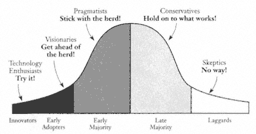

## Tornado Theory

- The tornado is a compressed period of hypergrowth that occurs once in the life of a market, coinciding with the first surge of mass market adoption of any new technology. 
- It creates a unique set of marketplace dynamics that frequently will catapult a single company into a position of overwhelmingly dominant competitive advantage. 
- This company becomes the gorilla, and the dominant competitive advantages it enjoys will allow it to generate exceptional returns to its investors for an unusually extended period. 
- The whole thrust of the gorilla game is to build long-term holdings in these gorillas.
- The tornado is the force behind the exponential customer adoption S curves that get drawn over and over again by high-tech market analysts.
- The gorilla architecture is acting something like a reef upon which this new ecosystem has sprung up, and therefore every living thing in the system has a stake in keeping it stable (including the customers).
- The tornado lasts only a few years, perhaps three to five, the time it takes for the initial surge of demand to be absorbed, after which the market reestablishes equilibrium with supply. 

## The Bowling Alley

- The bowling alley represents the market penetration phase of the Technology Adoption Life Cycle. It is located at the frontier of the mainstream market, just the other side of the chasm, and represents niches of pragmatist customers who are willing to adopt a new technology ahead of the herd.	
- But how can this be possible, since pragmatists are by definition herd animals? It is made possible by the fact that subsets of pragmatists, united by a common cause, aggregate into ''micro-herds" that move ahead of the main herd. Why? Because they are in pain. They need relief, and the only place they think they can find it is in the new technology.	
- Specifically, bowling alley market segments typically build up around departmental functions whose managers find themselves saddled with what we call a ``broken, mission-critical business process``. 
	- These broken processes are jeopardizing the entire enterprise's ability to serve its customers. 
	- Top management has put these managers on notice to fix the process, or else. 	
- Managers who are under this kind of "broken-process" pressure will sponsor a new technology ahead of the herd, but only if the system provider can commit to an end-to-end solution to their problem.	

## Bowling Alley Forever

- These markets never transform from niche to mass, but just continue along as a series of niches. 
- Such companies can continue to grow for only so long if they never enter into a true mass market. Sooner or later, they run out of new niches.
- This is the pattern that has characterized specialized niche companies like MapInfo and ESRI in geographical information systems, Applied Materials and Lam Research in semiconductor equipment, and Autodesk and Parametric Technology Inc. in mechanical CAD software. 

## Total Assimilation vs End of Life	

- Total assimilation represents the end of the Technology Adoption Life Cyclebut not the end of the product category. 
- Indeed, in most industries the bulk of the revenues and profits of the product category are generated long after the technology has been totally assimilated. Think of cars, televisions, microwave ovens, and the like. 
- The power relationships that will govern the category for the entirety of its Main Street market phase are established during the tornado phase, ``permanently!``

## Gorilla Value Chains

- Gorillas carve out the sweet spot from the value chains they dominate and leave the scraps to the partners. 
- When the customer demands some high-cost, low-value enhancement, the gorilla makes sure that the burden falls on someone else, not them. 
- They outsource, in other words, the low-value work. If the partner doesn't like it, they are free to leave. 
- There is always someone else to take their place. And if a partner or competitor tries to preempt the gorilla's claim on the high-value stuff, the gorilla can always change the standards on them to throw them off balance.
- Gorillas have great products because business partners prioritize complementing the market-leading solution before they put resources into complementing some other offer.

## Gorillas, Chimps and Monkeys

### Monkeys

- Monkeys are simply companies that clone the gorilla architecture and offer products 100%-compatible with the gorilla products at a discount. 
- They do not have permission to change standards, and therefore they cannot create new markets. 
- Moreover, whenever the gorilla makes any change to its de facto standard architecture, monkeys must stop whatever they are doing and reengineer their offers to restore 100% compatibility.

### Chimps

- Chimps are companies that tried to become the gorilla but just didn't get picked. 
- As such they have already invested heavily in their own product architecture, one they had hoped would become the gorilla standard, and one that is thoroughly incompatible with the gorilla's.
- Whereas the monkey has market scale but no barriers to entry, the chimp has barriers to entry but no market scale. 
	- Whatever customers it can win, it can keep, because like the gorilla, it too has proprietary control of an architecture.
	- The chimp is thereby forced to take one of two paths:	
		- Continue its attack on the gorilla in an attempt to wrest mass market control away from it.	
		- Retreat into one or more niche markets to become a "local gorilla" inside the niche.

## Kings, Princes and Serfs

Markets that have the "royalty structure" of king/prince/serf, as opposed to the "primate structure" of gorilla/chimp/monkey, pose an ambiguous challenge to the gorilla-game investor.

### King

- The market leader, properly with a two-times lead or better over its closest competitor.
- Kings enjoy a number of gorilla-like benefits, including economies of scale, favorable distribution terms, enhanced access to customers and partners, and favorable public relations.
- But because they lack architectural control, and because switching costs are low, they cannot force their competitors onto the defensive like gorillas.
- A king's power is neither as dramatic nor as persistent as a gorilla's, so you have to play much more cautiously and watch more closely for erosions in the king's position.

### Prince

- A market challenger, or potentially a coleader of a market that has no definable king. 
- Typically this company has around 10% to 15% market share.
- Princes make an interesting contrast to chimps:
	- On the downside, they have no proprietary barriers to entry to keep competitors at bay
	- On the upside, their competitors, even if they are kings, have no barriers to prevent the princes from attacking them.
	- Additionally, unlike the category of chimp, the category of prince permits aggressive merging.

### Serf

- This company often has 1% or less market share and is living hand-to-mouth off of opportunistic sales. 
- Individually these companies are insignificant, but taken collectively they serve a key role in the tornado, filling out the low end of the market, meeting the needs of those customers who cannot qualify for the attentions of a king or prince.

## Segmenting Gorillas

### The industry power of a software applications gorilla is less than that of an enabling technology gorilla.	

- the complexity of applications is such that it does not commoditize easily, and thus cannot proliferate as broadly or interoperate with other systems as intimately. 
- Application vendors have network effects only with entities immediately adjacent to their market space.
- Unlike their enabling-technology cousins, applications are the only products that the end-user customer ever actually sees. Therefore, whereas enabling products have the most industry power, application products have the most customer power.
	- So when markets are in the bowling alley, application vendors actually have greater power than enabling-technology vendors.
	- It is only after markets and infrastructures get swept up into the tornado, and customer demand can be increasingly taken for granted, that the power seeps down into the underlying layers.

### The core enabling-technology gorillas have the highest form of power in the gorilla game.	

- In enabling technologies, products commoditize extremely well, allowing them to proliferate into markets far afield from the original starting points and generate a high degree of network effects.
- Because all other vendors in the marketplace are ultimately both dependent upon and vulnerable to these gorillas, their behavior must be scrutinized on a daily basis, even if one were not invested in them.

